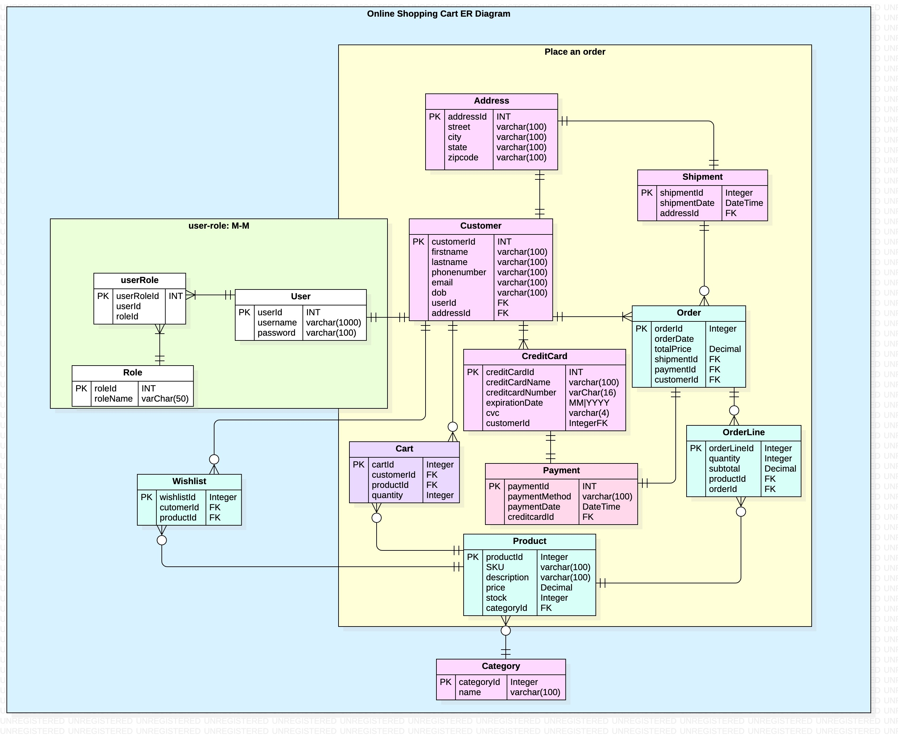

# Online Shopping Cart

## Online Shopping Cart Project Requirement
An online shopping system must be able to store information about the customers who register on the site and place orders. It must also store information about the products available for purchase, indicating price and stock data for each product. Customers must be able to have a shopping cart, where the products they choose from the catalog are stored before the customer is ready to place their order. In turn, each customer should be able to maintain a wish list (i.e. a list of products that they are interested in purchasing) without having yet included them in a shopping cart. When the customer confirms an order, the data model must be able to record the order data as well as payment and shipping information.

## ER Diagram



## Usage
- All the dependencies need:

```xml

```

## Testing with coverage


## Contributing

Pull requests are welcome. For major changes, please open an issue first
to discuss what you would like to change.

Please make sure to update tests as appropriate.

## License

[Sopheary Rin](https://sophearyrin-dev.github.io/)